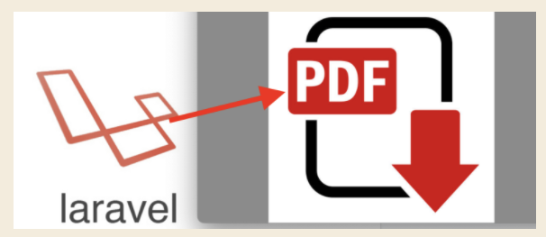

# Como trabalhar com PDF no Laravel 5.8? 

Projeto para demonstração de como podemos utilizar a biblioteca `laravel-dompdf`

O tutorial completo você encontra no meu 
[meu blog](http://www.adonaidiofanes.com.br/blog/laravel-como-exportar-pdf/)

O projeto está utilizando a [lib laravel/dompdf](https://github.com/barryvdh/laravel-dompdf)